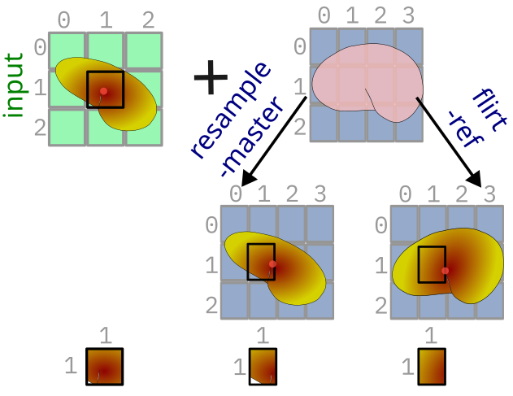

# Resampling vs Registration

Both resampling and registration (also spatial normalization/warping) modify the underlying matrices of one image to match that of another.
But unlike resampling, only registration and warping inspect and modify based on the data within the images.

Resampling is concerned with the matrix shape, registration with the matrix content.

From [Andy's Brain Book](https://andysbrainbook.readthedocs.io/en/latest/FrequentlyAskedQuestions/FrequentlyAskedQuestions.html#resampling)
> Resampling means changing either the resolution, dimensions, or both the resolution and dimensions of an image. 

Compared that to [warping](https://andysbrainbook.readthedocs.io/en/latest/fMRI_Short_Course/Preprocessing/Registration_Normalization.html#registration-and-normalization) where
> each brain [within an image] needs to be transformed to have the same ... shape

`3dresample` is an AFNI tool to resample an inset to the "master". We can compare it to FSL's `flirt` which reorients a brain to a reference (`-ref`).
Both commands produce a new image with the same grid. However, the output of the `flirt` command will have a brain that's been moved. The value of the voxel at `(i,j)` `(1,1)` will be different in the input, resampled (`3dresample`), and registered (`flirt`) images.

