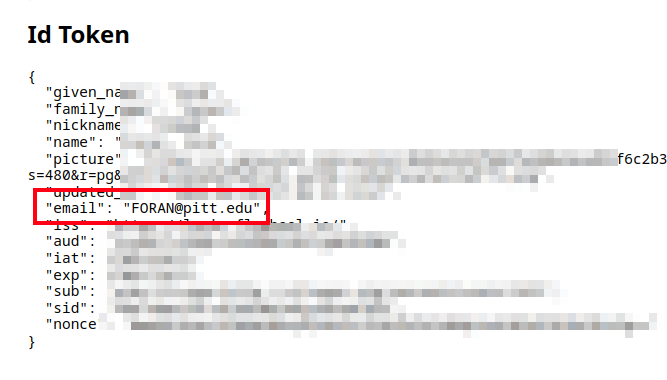

# Flywheel

## Web site
[fw.mrrc.upmc.edu](https://fw.mrrc.upmc.edu/) hosts the MRRC's flywheel instance.

For the moment[^pending], access is restricted to within the UPMC intranet.
You must either be in a UPMC building or access with a web browser launched from [myapps.upmc.edu](https://myapps.upmc.edu).

[^pending]: (Mar 2024, pending UPMC IT approval for global web accesses)

## Usage

See [docs.flywheel.io](https://docs.flywheel.io).


### CLI

The scanner connector should automatically "ingest" all study sessions. But the CLI tool can easily upload additional data!

```
fw ingest dicom --include 'MR.*' -vd 2024.02.15-08.50.45/11998_20240215/ luna wpc-8620-habit
```

This example is tailored to work with MRRC Prisma DICOMS. The command uploads the session folder `2024.02.15-08.50.45/11998_20240215/` including sub-directories for all acquisitions for that visit to the `luna` group's project `wpc-8620-habit`. Notably, we need to specify the dicom pattern as anything starting with `MR`.


## Authentication

Flywheel authentication uses pitt.edu credentials through "University Credential via CILogin."
MRRC Flywheel admins need your primary/non-aliased case sensitive (likely all caps) pitt email addresses to match CILogin and grant access.

You can find or confirm your Pitt account name following https://authtest.flywheel.io using "University Credentials" for "University of Pittsburgh."
After authenticating, the "Id Token" section's "email" field is the case sensitive email flywheel needs to give you access. Screenshots below.



<!-- also my profile in pitt -->
